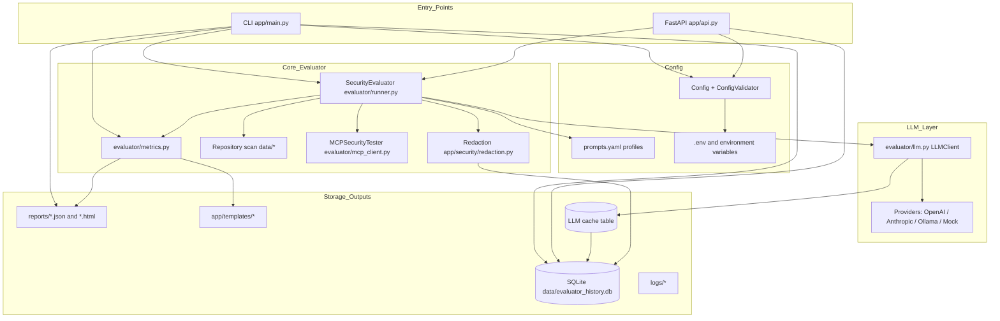
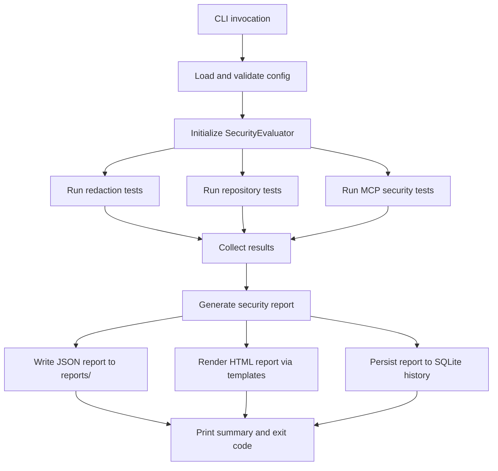
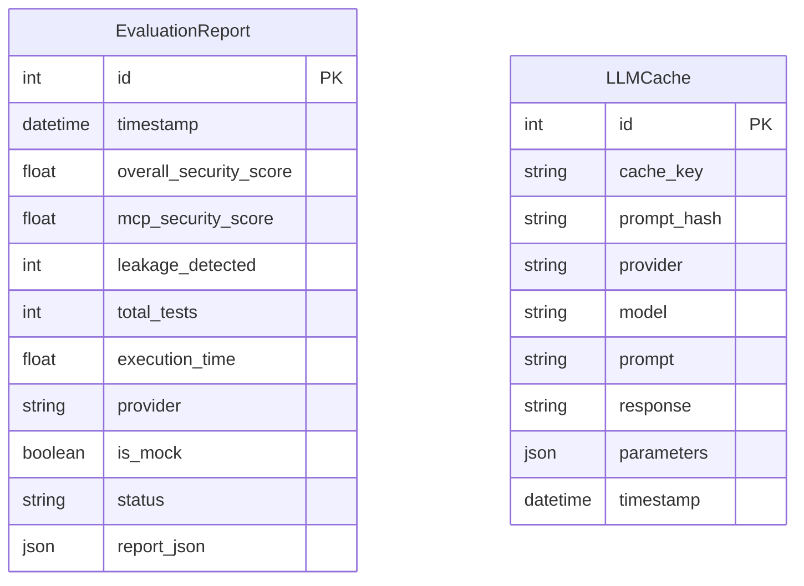

# Repository Architecture

This document summarizes the main runtime components and how data flows through the MCP LLM Security Evaluator.

## Component Overview



## CLI Evaluation Flow



## API Flow

```mermaid
flowchart TD
  Client[API client] --> Evaluate[/evaluate]
  Evaluate --> Background[Background task]
  Background --> Eval[SecurityEvaluator]
  Eval --> Report[Generate report]
  Report --> DB[(SQLite history)]
  Background --> WS[WebSocket progress events]

  Client --> Reports[/reports /reports/{id} /trends]
  Reports --> DB

  Client --> UI[/ and /monitor]
  UI --> Templates[app/templates/*]
```

## Database Schema



## Key Data Artifacts

- Configuration: `prompts.yaml`, `.env`, and environment variables
- Fixtures: `data/` repositories and sample files
- Reports: `reports/*.json` and `reports/*.html`
- History and cache: `data/evaluator_history.db` (SQLModel tables `EvaluationReport` and `LLMCache`)
- Logs: `logs/` based on `app/logging_config.py`
